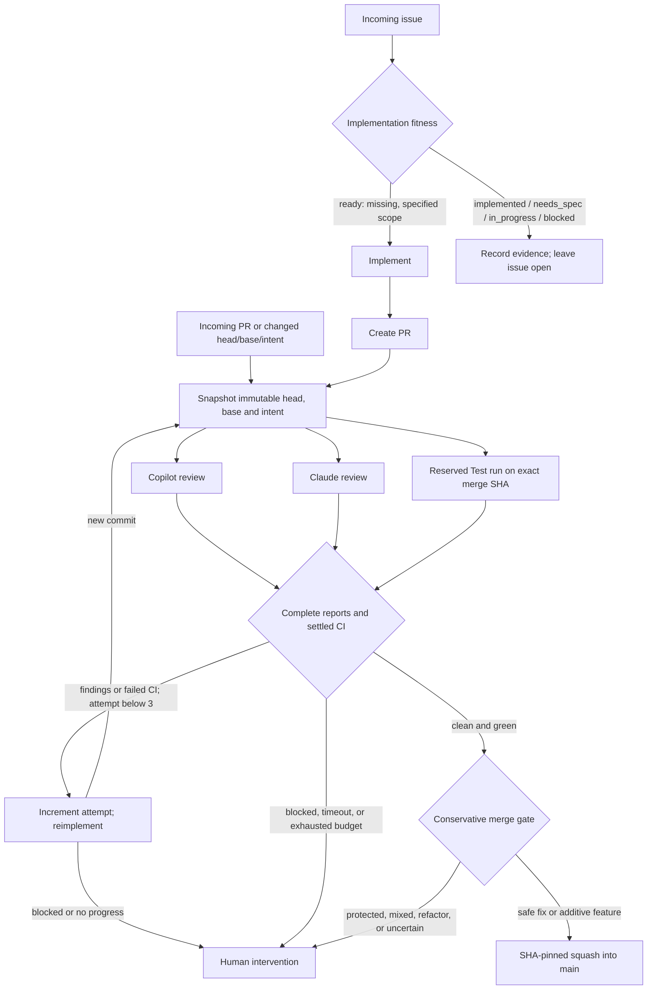

# Agentic workflows

Implementation of [#577](https://github.com/camunda/c8ctl/issues/577).
**Inactive by default.** Merging these files does not enable agent dispatch,
compiler-update writes, or automatic merging. No new c8ctl commands are added.

## Execution

Five [gh-aw](https://github.github.com/gh-aw/) workers:

- **Fitness / Copilot:** compare an issue's acceptance criteria with current
  `main`, tests, documentation, SDK gaps, and existing work.
- **Implement / Copilot:** implement only the accepted missing scope.
- **Review / Copilot:** independent correctness and compatibility review.
- **Review / Claude:** the same review, without seeing the Copilot verdict.
- **Reimplement / Copilot:** address combined findings and failed CI.

Markdown under `.github/workflows/` is the editable source. Matching `.lock.yml`
files and `.github/aw/actions-lock.json` are compiler output, not hand-edited policy.
The ordinary `agentic-controller.yml` workflow runs the deterministic TypeScript
coordinator in `scripts/agentic/`.



Initial implementation does not consume a repair attempt. Each repair dispatch
does, even if it fails. The third repair still gets both reviews and CI; a fourth
cannot start. Revision changes invalidate evidence, not the spent budget.
PR title, description, and draft-state changes also invalidate evidence; becoming
ready for review restarts intake without replenishing the session budget.
Sessions have a two-hour deadline, at most 20 automation operations, and a global
six-run concurrency ceiling. Worker turn, credit, and timeout caps are in
their Markdown frontmatter; inference entitlement must be confirmed during rollout.

The App-owned state comment records generation, revisions, reserved tasks,
worker runs, artifacts, deadline, and attempts. Duplicate events reconcile that
state rather than creating competing implementations. Bot state comments do not
count as new issue specifications. The 15-minute reconciliation schedule recovers
coalesced events and observes review changes; it is not a promise of immediate delivery.

## Trust and merge boundary

The controller reads event metadata and checks out **trusted `main` only**.
It does not install npm dependencies, run PR tests, import CLI application code,
or execute artifact contents. Workers run reviewed code without App write
credentials. A separate trusted publisher converts missing output, failed agents,
failed detection, and invalid reports into blocked results.

Workers run build, typecheck, and unit tests inside AWF. Live Camunda is not
available there, so their evidence explicitly marks integration and cross-platform
validation as pending. Only the existing Test CI can satisfy those requirements.

Reports are strict, bounded JSON in a single `report.json` artifact. Their
repository, workflow, dispatch identity, engine, run/attempt, generation, head,
and base must match the reserved task. Prose, review counts, stale reports, and
successful-but-skipped checks cannot establish a clean result.

The model's report-tool string uses a bounded gzip/base64 envelope. This preserves
tested source bytes through gh-aw's Markdown sanitization; raw JSON strings would
silently alter TypeScript generics and scoped imports. The publisher bounds
decompression, validates UTF-8 and the report schema, then emits ordinary JSON.

### CI revision receipts

GitHub's run/check metadata identifies the PR source head, not necessarily the
synthetic merge commit that was tested. Fork runs can have an empty
`pull_requests` array. Neither that metadata nor rerunning an old run proves that
the current base was tested.

For automation, the coordinator therefore reserves and dispatches **Test from
trusted `main`** with an exact head/base/merge tuple. Every existing matrix job
checks out the authorized merge SHA. A fresh read-only publisher records the
tuple, dispatch identity, run/attempt, workflow SHA, and job outcomes. The
coordinator requires that receipt and all required jobs; a receipt alone cannot
make failed or skipped tests green.

Normal PR and manual Test runs remain unchanged. This deliberately adds one
automation-owned Test run per revision, rather than accepting weaker provenance.
The global concurrency and session operation budgets include these dispatches.
Native PR checks still satisfy branch protection separately. Passing a fresh
synthetic merge does not waive strict branch up-to-date requirements.
Behind branches need an author or maintainer update; the controller does not
merge or rebase `main` into contributor branches. That update starts fresh reviews
and CI without resetting repair attempts.

Code writers accept bounded file contents, not executable patches. They reject
out-of-scope paths, ambiguous names, symlinks, mode changes, test deletions, and
no-op submissions. Writes use GitHub's `createCommitOnBranch` with the dispatched
`expectedHeadOid`; they never substitute a newly fetched branch head. Unwritable
fork work becomes a linked same-repository remediation PR with its own reviews.
The original PR is neither marked clean nor automatically closed.

Automatic merging additionally requires:

- Both reviewers agree on an evidence-backed bounded fix or additive feature,
  with no findings and no weakened existing-behavior guards.
- No protected automation, instructions, dependencies, release, migration, or
  authentication/authorization changes.
- Current Test CI and Release health, strict up-to-date branch protection,
  required checks/approvals, no unresolved threads or blocking reviews, and an
  open, non-draft, conflict-free PR targeting `main`.
- Fresh head/base and hold/switch checks, plus a compatible `fix:` or `feat:`
  squash message and understood pending release history.

Missing or unsupported protection fails closed. Merge queues are not supported:
the existing Test workflow lacks `merge_group` coverage. No App bypass, standing
auto-merge request, or stable promotion is used. Semantic-release continues to
publish alpha from `main` and stable from `release`.

GitHub atomically compares the expected **head**, not the hold label, variables,
or base SHA. These are re-read immediately before mutation; strict up-to-date
required checks provide the additional base-branch gate. A switch change cannot
undo an API mutation already accepted.

## Operator setup

Configure these repository variables and secrets only after reviewing the rollout:

| Setting | Purpose |
| --- | --- |
| `C8CTL_AUTOMATION_ENABLED` | Global switch; only literal `true` enables dispatch and writes |
| `C8CTL_AUTO_MERGE_ENABLED` | Separate merge switch; leave unset or `false` during trials |
| `C8CTL_DEPENDENCY_MAINTENANCE_ENABLED` | Separate generated-workflow writer switch |
| `C8CTL_AUTOMATION_SINCE` | Required UTC timestamp; avoids sweeping the historical backlog |
| `C8CTL_APP_CLIENT_ID` | Automation App's client ID |
| `C8CTL_APP_BOT_LOGIN` | Exact App login, including `[bot]`; authenticates state and worker dispatches |
| `C8CTL_APP_PRIVATE_KEY` (secret) | App private key; available only to trusted token-minting steps |
| `COPILOT_GITHUB_TOKEN` (secret) | Inference-only credential; no repository-write or administration permissions |
| `ANTHROPIC_API_KEY` (secret) | Claude inference credential |

Install the App on this repository only, without protection bypass. Grant
Actions, Contents, Issues, Pull requests, and Commit statuses write; Checks,
Administration, and Variables read. Compiler maintenance additionally needs
Workflows write. Runtime tokens are narrowed per job: the controller never
receives Workflows write, and maintenance never receives Administration or
Issues permissions.

`app-token.ts` uses Node's crypto and GitHub's installation-token REST API because
[`actions/create-github-app-token#231`](https://github.com/actions/create-github-app-token/issues/231)
still prevents requesting Variables permission through that action. Tokens are
repository-scoped, masked, and revoked in an `always()` cleanup step. There is no
write-token fallback to `GITHUB_TOKEN`.

Configure active strict protection and required checks on `main` before enabling
merges. Required checks must cover the existing Test lint, typecheck, unit, and
integration matrix, plus `c8ctl/agentic` bound to the configured App. The aggregate
status reports review/CI cleanliness, not permission to merge protected changes.
Neither an absent protection rule nor a disabled ruleset is
protection. Workflow-definition and dependency changes always need human review.

## Rollout and recovery

1. Merge the implementation with all switches unset or `false`. Confirm compiler
   drift checks and the normal Test workflow pass.
2. Trial in an isolated repository with a least-privilege App and both inference
   engines. Exercise every fitness result, duplicate/stale events, invalid or
   missing reports, reviewer disagreement, failed/skipped CI, holds, forks, and
   concurrent head/base changes. Prove a clean third repair can merge and a fourth
   cannot dispatch. Local transcript tests do not replace this live trial.
3. Set a deliberate `C8CTL_AUTOMATION_SINCE` timestamp and enable automation.
   Enable maintenance and merging separately, only after their trials and
   protection checks succeed.

To pause one issue or PR, add `agentic:hold`. To stop new automation, set
`C8CTL_AUTOMATION_ENABLED=false`; also cancel in-flight workers if inference must
stop immediately. Disabling the merge switch alone leaves review and repair running.
Inspect the App state comment and linked Actions runs for a blocked session.
Do not edit the state JSON or reuse old report artifacts.

After resolving the blocker, an authorized maintainer can explicitly reset a
subject's budget:

```sh
gh workflow run agentic-controller.yml --repo camunda/c8ctl --ref main \
  -f command=resume -f number=123
```

Use `command=reconcile` without a number to reconcile without resetting budgets.
Ordinary issue comments and new commits do not authorize a budget reset.

## Compiler updates

Renovate checks the single `.github/gh-aw-version` declaration daily against
GitHub's non-prerelease release metadata. Numeric-looking prerelease tags are
not automatically stable. Its former blanket minor/patch auto-merge is disabled.

For a same-repository Renovate compiler PR, maintenance validates the candidate,
compiles trusted sources in a read-only job, and passes bounded generated bytes
to a fresh privileged job. That job revalidates the PR, live switches, and hold,
then uses expected-head compare-and-swap. A repeat with identical output is a no-op.
Failed compilation or a new approval requirement blocks the update visibly; it
does not silently retain an older version. Engine-policy changes require review.

Use Node 22 and the declared gh-aw compiler locally:

```sh
gh aw version
node --experimental-strip-types scripts/agentic/maintenance.ts check
```

The check recompiles and rejects drift, missing outputs, and untracked generated
files. It inspects text diagnostics: gh-aw v0.88.7's JSON results omit safe-update
warnings, and exit status zero alone is insufficient. Candidate regeneration
explicitly refreshes action pins but never approves new policies automatically.
Keep compiler, generated runtime/action pins, and any reviewed engine
changes in the same PR. Require both reviewers and a live workflow regression
trial before manually merging toolchain changes.
